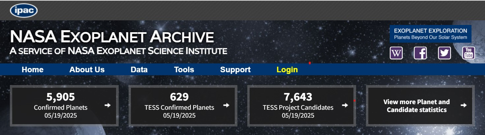

# **EDA Exoplanetas y Vida extraterreste**



## ¿ Es posible demostrar con los datos de los que se dispone sobre exoplanetas confirmados las siguientes hipótesis?

🔬 **Hipótesis 1:**  
"Los exoplanetas ubicados dentro de la zona habitable de su estrella tienen mayor probabilidad de albergar condiciones aptas para la vida."  

🌍  **Hipótesis 2:**   
"Los exoplanetas rocosos con masas similares a la de la Tierra son los principales candidatos para albergar vida."    

☀️ **Hipótesis 3:**   
"Las estrellas de tipo espectral G (como el Sol) y K (enanas naranjas) son más propensas a tener planetas con condiciones aptas para la vida debido a su estabilidad y longevidad."  

🌎 **Hipótesis 4:**   
"Los exoplanetas con órbitas casi circulares tienen mayores probabilidades de tener climas estables, lo cual favorece el desarrollo de vida."  

🪐 **Hipótesis 5:**   
"Los sistemas planetarios con múltiples planetas aumentan las probabilidades de que al menos uno de ellos se ubique en la zona habitable."  

🌫 **Hipótesis 6:**   
"Los exoplanetas con atmósferas densas y estables podrían conservar agua líquida, lo cual favorece la posibilidad de vida."

## ESTRUCTURA DEL PROYECTO
```plaintext
📁 Estructura del proyecto
├── Datasets/
│   ├── datos1.csv
│   └── datos2.csv
├── Imagenes/
│   ├── grafico1.png
│   └── diagrama.jpg
├── Notebooks/
│   ├── analisis_exoplanetas.ipynb
│   └── visualizacion.ipynb
└── Scripts/
    ├── limpieza.py
    └── utils.py
